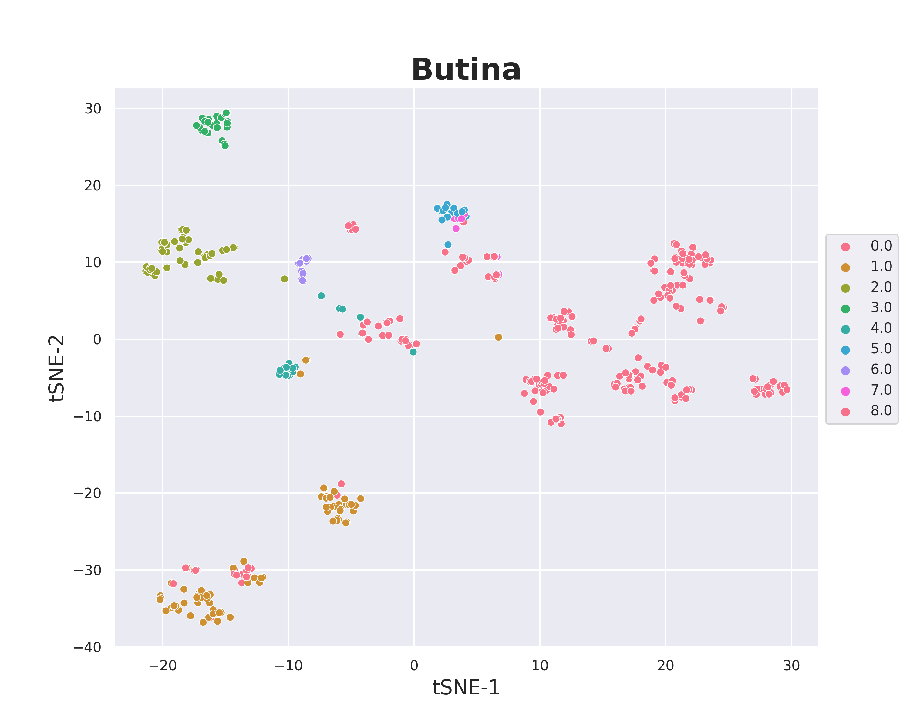

# MolecularClustering overview

## Use butina algorithm to cluster molecules



## Result heatmap of selected molecules


## Requirements

This module requires the following modules:

- [RDkit](https://www.rdkit.org/)
- [scikit-learn](https://scikit-learn.org/stable/)

## Installation
To do...
## Usage

```python
from molecules_clustering import Butina_clustering, Molecule_clustering
from diversesubset import distance_maxtrix, diverse_subset
from cluster_visualize import cluster_heat_map, cluster_scatter_plot

# Butina Clustering
butina = Butina_clustering(df = data, ID = "ID", smiles_col = "StandSmiles", active_col = 'Activity', 
                             mol_col = 'Molecule', activity_thresh = 7, radius= 2, nBits = 2048, 
                             dis_cutoff = 0.65, cps = 5)
active_set, cluster_centers,  df_active = butina.data_processing()

# heatmap visualize
plot = cluster_heat_map(cls_cps = cluster_centers)
plot.visualize_triangle()

# chemical space visualize
plot = cluster_scatter_plot(data=df_active, no_cls= 8, mol_col='Molecule', algo = 'Butina',cluster_col='Cluster',)
plot.visualize()

```

## Contributing

Pull requests are welcome. For major changes, please open an issue first
to discuss what you would like to change.

Please make sure to update tests as appropriate.

## License

None